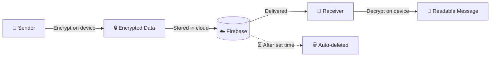

<div align="center">


<a href="https://pingora-ten.vercel.app/">
  
</a>

<br/>

[](https://pingora-ten.vercel.app/)
[](https://github.com/Mr-Farooqi/Pingora/stargazers)
[](https://github.com/Mr-Farooqi/Pingora/commits/main)
[](https://vercel.com)

<br/>


</div>

---

## ✨ About

**Pingora** is a privacy-first, real-time chat web application. Anyone can register, find other users, and talk to them knowing that **nobody else can read the conversation**.

Unlike typical chat apps, Pingora stores almost nothing about you:

> 🔑 **Only login details are saved.** Every message and every shared file is stored in **encrypted form**, and is **automatically deleted** after a set period of time.

<div align="center">

<!-- 📸 Replace this with your own banner / screenshot -->
<!--  -->

</div>

---

## 🚀 Features

| | Feature | Description |
|---|---|---|
| 🔐 | **End-to-End Encryption** | Content is encrypted before it leaves your device. |
| 💬 | **Real-time Messaging** | Instant one-to-one conversations between registered users. |
| 🖼️ | **Image & Video Sharing** | Send photos and videos privately. |
| 🎙️ | **Voice Messages** | Record and send voice notes. |
| 📎 | **File Sharing** | Share documents and files securely. |
| ⏳ | **Auto-Delete** | Encrypted data is wiped after a fixed time period. |
| 👤 | **Minimal Data Storage** | Only account login details are kept, nothing more. |
| 📱 | **Responsive UI** | Works on desktop, tablet and mobile. |

---

## 🛡️ How Privacy Works



1. **Register / Login**: only your account details are stored.
2. **Send**: messages, media, voice and files are encrypted on your device.
3. **Store**: the server only ever holds encrypted data.
4. **Read**: only the receiver can decrypt it.
5. **Expire**: after the set time, the encrypted data is permanently deleted.

---

## 🧰 Tech Stack

<div align="center">

| Layer | Technology |
|:---:|:---:|
| **Frontend** | React 19 (Create React App) |
| **Backend / Database** | Firebase |
| **Security** | Client-side end-to-end encryption |
| **Hosting** | Vercel |

</div>

---

## 📂 Project Structure

```bash
Pingora/
├── public/          # Static assets
├── src/             # React source code (components, pages, logic)
├── build/           # Production build output
├── package.json     # Dependencies & scripts
└── README.md
```

---

## ⚙️ Getting Started

### Prerequisites

- [Node.js](https://nodejs.org/) v18 or higher
- npm
- A [Firebase](https://console.firebase.google.com/) project

### Installation

```bash
# 1. Clone the repository
git clone https://github.com/Mr-Farooqi/Pingora.git

# 2. Go into the project folder
cd Pingora

# 3. Install dependencies
npm install

# 4. Start the development server
npm start
```

The app will open at **http://localhost:3000** 🎉

### 🔧 Firebase Setup

1. Create a project on the [Firebase Console](https://console.firebase.google.com/).
2. Enable the Firebase services your app uses (Authentication, database, storage).
3. Add your config in your project's Firebase config file, ideally using environment variables:

```bash
# .env  (never commit this file)
REACT_APP_FIREBASE_API_KEY=your_api_key
REACT_APP_FIREBASE_AUTH_DOMAIN=your_project.firebaseapp.com
REACT_APP_FIREBASE_PROJECT_ID=your_project_id
REACT_APP_FIREBASE_STORAGE_BUCKET=your_project.appspot.com
REACT_APP_FIREBASE_MESSAGING_SENDER_ID=your_sender_id
REACT_APP_FIREBASE_APP_ID=your_app_id
```

### 📜 Available Scripts

| Command | What it does |
|---|---|
| `npm start` | Runs the app in development mode |
| `npm run build` | Creates an optimized production build |
| `npm test` | Launches the test runner |

---

## 🗺️ Roadmap

- [x] User registration & login
- [x] Encrypted text messaging
- [x] Image, video, voice & file sharing
- [x] Auto-delete of encrypted data
- [ ] Group chats
- [ ] Message reactions
- [ ] Voice & video calls
- [ ] PWA / installable app

---

## 🤝 Contributing

Contributions, issues and feature requests are welcome!

1. Fork the project
2. Create your branch: `git checkout -b feature/amazing-feature`
3. Commit your changes: `git commit -m "Add amazing feature"`
4. Push the branch: `git push origin feature/amazing-feature`
5. Open a Pull Request

---

## 👨‍💻 Author

<div align="center">

**Faruqui**

[](https://github.com/Mr-Farooqi)

<br/>

⭐ **If you like Pingora, give it a star!** ⭐


</div>
